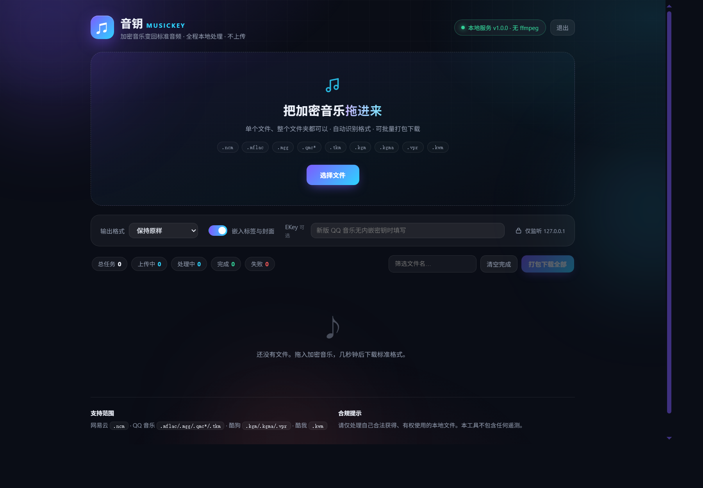

# 音钥 MusicKey

[](LICENSE)
[](https://www.python.org/)
[](README.md)
[](tests)

一个把加密音乐变成标准音频文件的本地工具。支持网易云、QQ 音乐、酷狗、酷我四个平台的常见加密格式，**所有解密都在本机完成，不上传文件**。

本项目的格式算法参考 MIT 协议的 [music-geshizhuanhuan](https://github.com/HRuiCcc/music-geshizhuanhuan)、[unlock-music](https://github.com/unlock-music) 等公开资料，并在其许可范围内重新实现了流式引擎、任务队列、前端与打包流程。

## 项目介绍

「音钥 MusicKey」是一款面向音乐文件持有者的本地格式恢复工具：将网易云 `.ncm`、QQ 音乐 `.mflac/.mgg/.qmc*/.tkm`、酷狗 `.kgm/.kgma/.vpr`、酷我 `.kwm` 等加密文件还原为普通播放器可以打开的 MP3、FLAC、M4A、WAV 或 OGG。

它采用纯本地运行架构：网页服务默认只监听 `127.0.0.1`，文件不会离开电脑。项目提供网页版、命令行版和 Windows 单文件版，适合个人整理音乐库、导入车载 U 盘、剪辑软件或移动设备。



## 下载使用

不想自己构建？直接在 [Releases 页面](https://github.com/Xiaowu-0916/music-key/releases) 下载即可：

- **MusicKey.exe**：Windows 单文件版，双击启动网页界面，内置 ffmpeg。
- **MusicKey-CLI.exe**：命令行批量版本。

两个程序都是 45 MB 左右的单文件，下载后不用安装、不用配 Python，直接运行。

## 支持格式

| 平台 | 扩展名 | 说明 |
|---|---|---|
| 网易云音乐 | `.ncm` | 完整提取歌名、歌手、专辑、封面 |
| QQ 音乐 | `.mflac .mgg .mflac0 .mgg0 .mgg1 .mggl .mmp4 .qmcflac .qmcogg .qmc0~8` | v2 内嵌 EKey / QTag / PcV1Legacy |
| QQ 音乐 | `.tkm .bkcmp3 .bkcm4a .bkcflac .bkcwav .bkcape .bkcogg .bkcwma` | v1 静态密钥 |
| 酷狗音乐 | `.kgm .kgma .vpr .kgm.flac .vpr.flac` | v3/v4 离线可用 |
| 酷我音乐 | `.kwm` | 老版格式 |

输出格式：保持原样、MP3、FLAC、M4A、WAV、OGG。需要统一转码时可使用内置的 ffmpeg（单文件版已内置）。

## 快速开始

### 方式一：Windows 单文件版

1. 从 [Releases](https://github.com/Xiaowu-0916/music-key/releases) 下载 `MusicKey.exe`。
2. 双击运行 `MusicKey.exe`。
3. 浏览器会自动打开 `http://127.0.0.1:8690`。
4. 把文件或文件夹拖进去，选择输出格式，等待完成后下载或打包。
5. 页面右上角的“退出”可以关闭本地服务。

### 方式二：源码运行

```powershell
cd musickey
python -m venv .venv
.venv\Scripts\python.exe -m pip install -r requirements.txt
.venv\Scripts\python.exe run.py             # 默认启动网页版并打开浏览器
```

### 命令行

```powershell
# 解密到 unlocked 目录
.venv\Scripts\python.exe run.py 歌曲.ncm

# 目录递归，统一转码为 FLAC
.venv\Scripts\python.exe run.py 音乐目录 -o out --format flac

# 并行 4 个任务，显示任务进度
.venv\Scripts\python.exe run.py 音乐目录 --jobs 4

# 预览计划，不写文件
.venv\Scripts\python.exe run.py 音乐目录 --dry-run
```

常用参数：`-o/--output`、`--format`、`--jobs`、`--force`、`--no-recursive`、`--ekey`、`--ekey-db`、`--kgm-key`、`--ffmpeg`、`--json`、`--open`。

## 为什么比原始方案更完善

- **流式解码**：NCM、QMC、KGM、KWM 都按块读写，不再把整个音频文件读进内存；大文件和批量任务更稳定。
- **准确的格式识别**：同时支持魔数、扩展名、QMC 尾包嗅探，修复了 `.kgm.flac`、`.vpr.flac` 这类多段后缀被漏掉的问题。
- **异步网页服务**：上传后立刻返回任务号，服务端 2 路后台队列处理，前端可实时看到进度、预览、下载、取消和重试。
- **更快的 KGM 核心**：用单字节推导表替代“17 相位 × 256×256”的大内存查表，速度更快且不会缓存数百 MB。
- **完整标签链路**：解密后自动读取/保留原标签，NCM 元数据和封面写入 MP3、FLAC、M4A、OGG、WAV。
- **更友好的界面**：响应式深色玻璃拟态 UI、文件夹拖放、筛选、批量打包、音频试听、任务状态。
- **更可靠的打包**：提供 Windows 单文件 `MusicKey.exe` 与控制台 `MusicKey-CLI.exe`，并内置 ffmpeg 资源路径检测。

## 构建单文件版

在 Windows PowerShell 中：

```powershell
.\build.ps1
```

构建完成后：

- `dist\MusicKey.exe`：双击启动网页版
- `dist\MusicKey-CLI.exe`：命令行批量版本

构建脚本会安装 `pyinstaller`、`imageio-ffmpeg`，并自动把 ffmpeg 与静态资源打进 exe。

## 测试

```powershell
.venv\Scripts\python.exe -m pytest tests -q
```

测试使用程序合成的占位音频，验证 NCM、QMC v1/v2、KGM、KWM 的流式往返，以及网页 API 的上传、解码、下载、zip 全链路。

## 合规说明

请仅处理自己合法购买、下载或有权使用的本地文件。禁止用于批量分发、倒卖或规避付费授权。本项目不包含遥测，不连接远程服务器。
